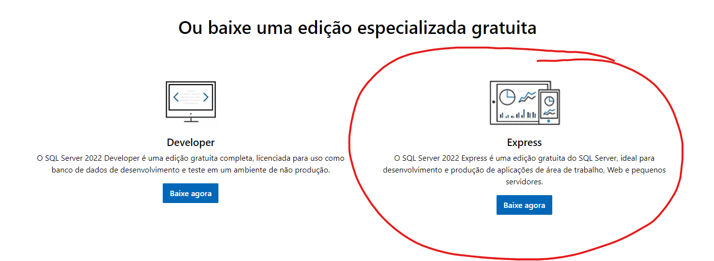
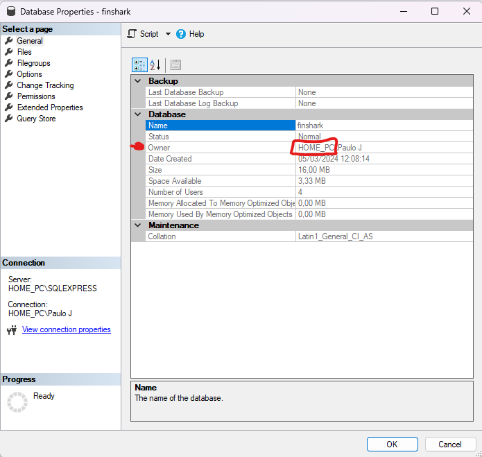

# This is a simple CRUD application using ASP.NET Core Web API .NET 8 and Entity Framework Core

### The application is a simple CRUD of Stocks and Stocks comments. It allows you to

- List all stocks
- List all comments of a stock
- Add a new stock
- Add a new comment to a stock
- Update a stock
- Update a comment
- Delete a stock
- Delete a comment
- Search for a stock by Symbol
- Search for a stock by CompanyName
- Search for a stock by Purchase
- Search for a stock by LastDiv
- Search for a stock by Industry
- Search for a stock by MarketCap

### The application uses a SQL Server database to store the data. The database is created using Entity Framework Core Code First approach

### The application uses the following technologies

- .NET 8
- Entity Framework Core
- SQL Server

### To connect to the database you will need to install <a href="https://www.microsoft.com/pt-br/sql-server/sql-server-downloads"> SQL SERVER</a> using the Express version



And then you will need to install the SSMS (SQL Server Management Studio) <a href="https://learn.microsoft.com/pt-br/sql/ssms/download-sql-server-management-studio-ssms"> SSMS</a>

Get All data from appsettings.Development.json and create the appsettings.json

After that you will need to change {YOUR_PC_NAME} to you PC name in the SQL Server management


### To run the application you will need to run the following commands

```bash
dotnet ef migrations add Init
dotnet ef database update
dotnet watch run
```
